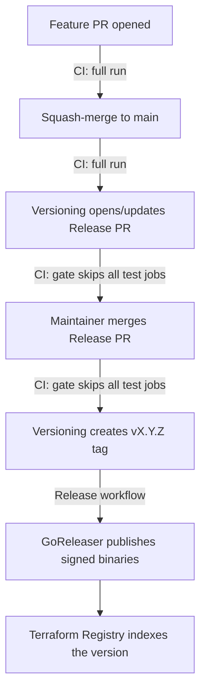

# CI and release pipeline

Human-oriented map of how a change travels from a pull request to a published
release, and why the pipeline skips work it doesn't need. For the
release/registry runbook see [RELEASE.md](RELEASE.md); this document covers
the CI mechanics.

> **PUBG fork:** Build and test workflows run unchanged. Versioning and release
> jobs are skipped automatically when GitHub identifies the repository as a
> fork; see [FORK.md](FORK.md).

## Workflows at a glance

| Workflow | File | Trigger | Purpose |
|---|---|---|---|
| CI | `.github/workflows/test.yml` | PR, push to `main` | Lint, unit, acceptance, integration and docs checks |
| CodeQL (advanced) | `.github/workflows/codeql.yml` | PR, push to `main`, weekly cron, manual | Static security analysis, provides the "CodeQL (go)" check (note: branch protection currently requires the org default-setup "Analyze (go)" check, not this one) |
| PR Title Check | `.github/workflows/pr-title.yml` | PR | Enforces Conventional Commit PR titles (they become the squash-commit messages release-please reads) |
| Versioning | `.github/workflows/versioning.yml` | After every CI run on `main` (`workflow_run`), manual | release-please: opens/updates the Release PR; creates the tag when it merges |
| Release | `.github/workflows/release.yml` | Push of a `v*` tag | GoReleaser: builds, signs and publishes binaries |
| Stale | `.github/workflows/stale.yml` | Daily cron | Labels inactive issues/PRs |

## Life of a change

A single code change used to run the full acceptance suite **four** times on
its way to a release (PR, merge, Release PR, Release PR merge). The `changes`
gate in `test.yml` cuts that to the two runs that test something new — the
Release PR only touches `CHANGELOG.md` and `.release-please-manifest.json`,
so re-testing the already-merged code there added minutes and runner cost but
no signal.

## The changes gate

The first job in CI, `changes`, uses
[dorny/paths-filter](https://github.com/dorny/paths-filter) to classify the
diff, and every other job declares `needs: changes` plus an `if:` condition
on its `code` output. `code` is false **only** when the diff touches nothing
but root-level markdown (`README.md`, `CHANGELOG.md`, ...), `LICENSE`, or
`.release-please-manifest.json`. Everything else — including `docs/**` and
`templates/**` — counts as code: `docs/` is published to the Terraform
Registry at each release tag and is user-visible, so doc changes get the
full pipeline like any other change.

What runs for typical changes:

| Change | Lint / Unit / Acceptance / Integration / Docs | CI OK |
|---|---|---|
| Go code, workflows, integration fixtures | ✅ | ✅ |
| `docs/**` or `templates/**` (registry-published docs) | ✅ | ✅ |
| README / CHANGELOG / LICENSE only | skipped | ✅ |
| Release PR (changelog + manifest) | skipped | ✅ |

### Why a gate job instead of workflow-level `paths-ignore`

`paths-ignore` on the workflow trigger looks simpler but breaks two things:

1. **Required checks are never reported on filtered PRs.** Branch protection
   requires the CI job checks; if the workflow doesn't trigger at all, the
   checks stay "Expected" forever and a docs-only PR can never be merged.
   A job skipped by an `if:` condition, by contrast, reports "skipped" —
   which **does** satisfy branch protection.
2. **The release chain dies.** `versioning.yml` triggers on
   `workflow_run: [CI]`. If a push to `main` doesn't start CI at all, that
   event never fires — release-please wouldn't run after the Release PR
   merge and the tag would never be created. With the gate, CI always runs
   (its jobs just skip), so `workflow_run` always fires.

### The CI OK job

`ci-ok` runs on every non-cancelled run (`if: ${{ !cancelled() }}` — a
superseded PR run cancelled by the concurrency group skips it instead of
posting a red check on a dead SHA), checks every other job's result, and
fails if any of them failed or was cancelled ("skipped" is fine). It also
asserts that its own `needs:` list matches the workflow's job list, so a
newly added job can't silently escape its watch. It exists because:

- a run whose jobs were **all** skipped needs at least one executed job for
  the run-level conclusion — which gates Versioning — to be a deterministic
  `success`;
- **"CI OK" must be a required status check** (it is, alongside the
  individual job names). The individual checks alone cannot be relied on:
  if the `changes` gate job itself *fails* (API flake, runner loss), every
  test job is `skipped`, and skipped checks satisfy branch protection — a
  failing "CI OK" is the only thing that blocks such a PR from merging
  untested.

## How docs reach the Terraform Registry

`docs/` is **not** shipped inside the GoReleaser artifacts. When GoReleaser
publishes the GitHub Release for a `vX.Y.Z` tag, the Terraform Registry
webhook ingests the release and the registry renders documentation by
reading the repository **at that git tag** — `docs/index.md`,
`docs/resources/*`, `docs/data-sources/*` become that version's docs pages.
Consequences:

- A docs change merged to `main` is invisible to registry users until the
  next release tag; each published version keeps the docs as of its tag,
  and a published version's docs can never be edited afterwards.
- **Convention** (same as terraform-provider-spaceship): corrections to
  registry-published docs — the `docs/` tree and the `templates/` that
  generate it — are typed **`fix(docs):`** so release-please treats them as
  releasing changes and cuts a patch release. Repo-internal markdown
  (README, `RELEASE.md`, `CI.md`, `CLAUDE.md`) stays plain `docs:`, which
  does not release.
- `docs/` is generated by `make generate` from `templates/` and the provider
  schema; the Docs job fails the build if the committed `docs/` doesn't
  match the generated output.

## Cost and speed effect

Measured on a typical release cycle (Aug 2026): a full CI run takes ~4–4.5
minutes, dominated by the acceptance job (Dockerized Jenkins). The gate
removes two full runs per release — the Release PR and its merge commit both
finish in seconds — cutting post-merge release latency roughly in half
(the remaining time is GoReleaser's ~6-minute build) and dropping the
repository's Actions consumption accordingly.

## Editing the pipeline — invariants to keep

- **Don't add `paths`/`paths-ignore` to `test.yml` or `codeql.yml` triggers**
  (see above; `codeql.yml` has the same required-check constraint).
- **Keep `ci-ok` in `needs` sync**: every job added to `test.yml` must also
  be added to the `ci-ok` `needs:` list. "CI OK" is a required status check
  and only guards the jobs it watches. This is enforced — `ci-ok`'s first
  step diffs its `needs:` against the workflow's job list and fails on
  drift.
- **New "expensive" jobs should take the gate**: `needs: changes` +
  `if: needs.changes.outputs.code == 'true'`.
- **The gate's ignore list must stay a subset of "files that can't affect
  the binary, tests, or published docs"** — when in doubt, let the job run.
  In particular `docs/**` must never be added to it: registry-published
  documentation is a user-visible deliverable.
